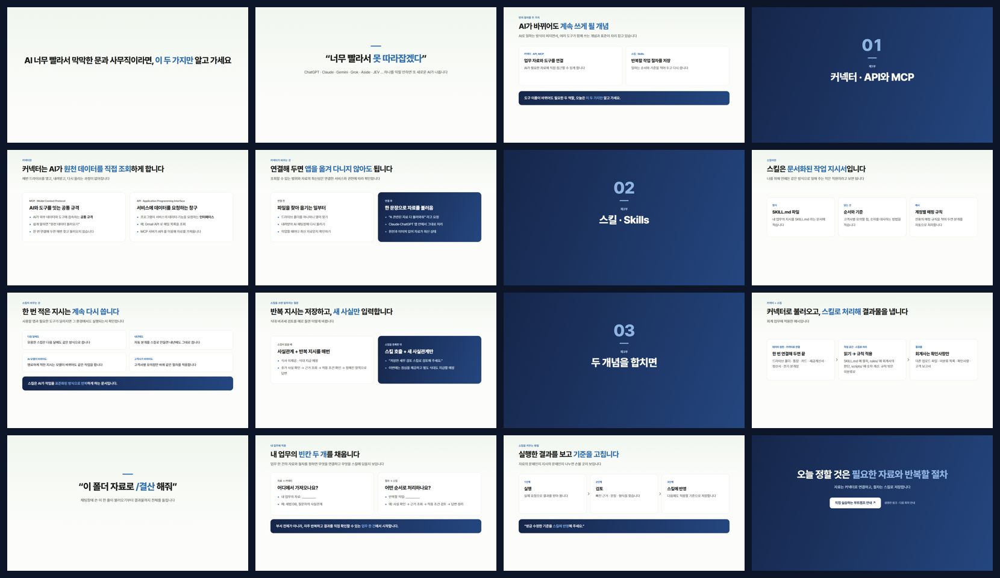
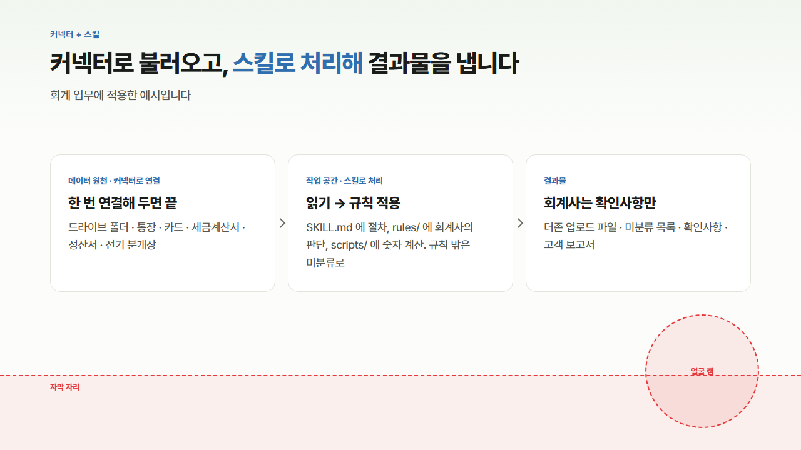

# youtube-lecture-slides

유튜브 강의 녹화용 **HTML 강의안(16:9, 파일 하나)** 을 만드는 Claude Code 스킬.
디자인은 원데이 AI Bootcamp([bootcamp.kernelacademy.io](https://bootcamp.kernelacademy.io))와 같고, 화면 아래 **자막 띠**와 오른쪽 아래 **원형 얼굴 캠** 자리를 비워 둔다.

대본·아웃라인·마크다운·기존 강의안을 주면 영상용으로 다시 짜고, 장마다 낭독 대본을 발표 노트에 넣고, 자막·캠 자리를 침범하지 않았는지 브라우저로 실측 검사한다.



## 자막·캠 자리



슬라이드 아래 200px 를 비운다. 녹화 프로그램의 캠 크기·위치가 다르면 템플릿 `:root` 의 변수만 고친다.

| 변수 | 기본값 | 뜻 |
|---|---|---|
| `--safe-b` | 200px | 슬라이드 아래에서 비울 높이 |
| `--sub-h` | 120px | 자막 띠 높이(안내선) |
| `--cam-l` / `--cam-t` / `--cam-d` | 1031 / 503 / 182px | 캠 원의 왼쪽 · 위 · 지름 |

녹화 전에 `V` 를 누르면 위 그림처럼 점선 안내선이 뜬다.

## 설치

```bash
git clone https://github.com/minsooparkk/youtube-lecture-slides.git ~/.claude/skills/youtube-lecture-slides
```

Claude Code 에서 "이 대본으로 유튜브 강의안 만들어줘", "녹화할 강의 화면 만들어줘" 처럼 요청하면 동작한다.

**필요한 것:** Python 3, Chrome 또는 Edge(검사·스크린샷·PDF), 인터넷(Pretendard 글꼴). Pillow 가 있으면 한눈 보기 이미지도 만든다.

## 녹화 순서

1. 강의안 HTML 을 크롬·엣지로 열고 `F` 로 전체화면
2. `V` 로 안내선을 켜서 캠 위치를 맞춰 보고 다시 `V` 로 끄기
3. 노트 창(`N`)은 화면에 찍히니 대본은 다른 모니터나 인쇄본으로
4. `→` 로 넘기며 `L` 레이저, `D` 펜(`1`~`5` 색, `C` 지우기)
5. 마우스를 멈추면 조작 막대가 숨는다

## 구성

| 파일 | 내용 |
|---|---|
| `SKILL.md` | 스킬 본문 — 배치, 디자인 원칙, 만드는 순서, 녹화 순서 |
| `assets/template.html` | 디자인·발표 기능·영상 배치가 들어 있는 템플릿 |
| `assets/layouts.md` | 장 종류, 본문 부품, 분량, 색 규칙 |
| `assets/writing.md` | 화면 문구와 노트 쓰는 법 |
| `scripts/check.py` | 실측 검사(자막·캠 자리 포함) · 스크린샷 · PDF |

```bash
python scripts/check.py 강의안.html --shots ./shots
python scripts/check.py 강의안.html --pdf 강의안.pdf
```

## 단축키

| 키 | 하는 일 |
|---|---|
| `→` `Space` / `←` | 다음 / 이전 |
| `F` · `F5` · 더블클릭 | 전체화면 |
| `V` | 자막·캠 안내선 |
| `D` | 펜 (`1`~`5` 색, `Z` 되돌리기, `C` 지우기) |
| `L` | 레이저 포인터 |
| `N` | 발표 노트 |
| `G` | 전체 보기 |
| `E` / `Ctrl+S` | 글자 편집 / 새 파일로 저장 |
| `?` | 단축키 표 |

현장 강의·일반 발표용은 [kernel-slides](https://github.com/minsooparkk/kernel-slides).

## 라이선스

[MIT](LICENSE)
